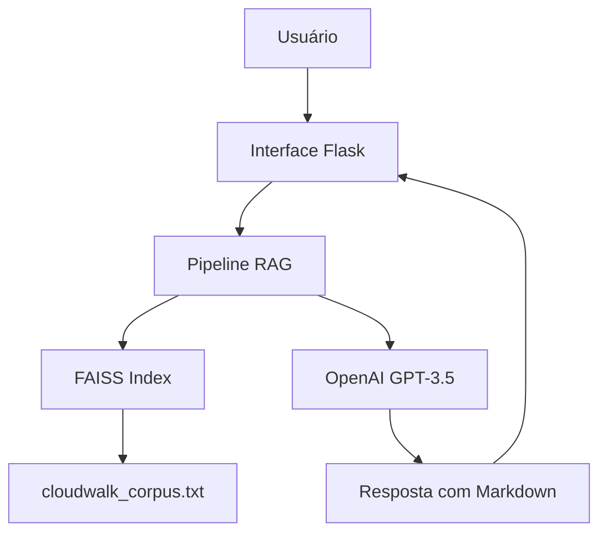

# 🤖 CloudWalk Chatbot – RAG Assistant com FAISS + Flask

Este projeto foi desenvolvido como parte do processo seletivo para a vaga de **Data Alchemist** na CloudWalk.

Ele implementa um chatbot com **RAG (Retrieval-Augmented Generation)** verdadeiro, utilizando **FAISS** para recuperação semântica de informações a partir de um corpus institucional.

---

## 🚀 Funcionalidades

- 🔍 **RAG verdadeiro com FAISS + Embeddings da OpenAI**
- 📚 **Recuperação dinâmica** de contexto baseada na query do usuário
- 💬 Interface web simples com **Flask** + suporte a **Markdown**
- 🕘 **Histórico de conversas** armazenado em memória
- ✅ **Testes automatizados** com Pytest
- ☁️ **Deploy-ready** para plataformas como Render ou Railway

---

## 🧠 Tecnologias Utilizadas

- Python 3.11+
- Flask
- LangChain
- langchain_community e langchain_openai
- FAISS (Facebook AI Similarity Search)
- OpenAI API
- Pytest
- Mermaid.js (para diagrama da arquitetura)

---

## 🧩 Arquitetura



O chatbot realiza busca **semântica** via FAISS em documentos previamente indexados.  
A cada nova pergunta, os documentos mais relevantes são recuperados **dinamicamente** com base na query, formando o contexto para a LLM (Large Language Model).

---

## 📁 Estrutura de Arquivos

```
cloudwalk-chatbot/
├── app.py                         # Interface Flask com histórico de conversas
├── utils/
│   ├── rag_pipeline.py           # Pipeline RAG com FAISS + OpenAI
│   └── cloudwalk_corpus.txt      # Cópia de trabalho do corpus institucional
├── data/
│   └── cloudwalk_corpus.txt      # Corpus original fornecido no desafio
├── tests/
│   └── test_rag_pipeline.py      # Testes com Pytest
├── requirements.txt              # Dependências do projeto
└── README.md                     # Documentação do projeto
```

---

## 💡 Exemplos de Conversas

🔹 **Exemplo 1**  
**Usuário:** O que é a InfinitePay?  
**Chatbot:**  
A InfinitePay é uma plataforma da CloudWalk no Brasil que oferece soluções de pagamento e serviços financeiros para pequenos e médios negócios. Seus recursos incluem:

- Maquininhas de cartão  
- Conta digital PJ  
- Cashback  
- Pix ilimitado  
- Loja online  
- InfiniteTap  

---

🔹 **Exemplo 2**  
**Usuário:** O que é o projeto Stratus?  
**Chatbot:**  
O Stratus é a infraestrutura descentralizada da CloudWalk baseada em blockchain. Ela conecta comerciantes, consumidores e desenvolvedores em uma rede global, permitindo transações rápidas, seguras e de baixo custo. O Stratus também suporta a moeda digital BRLC.

---

🔹 **Exemplo 3**  
**Usuário:** Como a CloudWalk utiliza inteligência artificial?  
**Chatbot:**  
A CloudWalk aplica IA para criar soluções eficientes e escaláveis, incluindo:

- Automatização de atendimentos  
- Análise preditiva de crédito  
- Customização de pagamentos  
- Geração de conteúdo para assistentes  

---

## ▶️ Como Executar Localmente

```bash
# 1. Clone o projeto
git clone https://github.com/seu-usuario/cloudwalk-chatbot.git
cd cloudwalk-chatbot

# 2. Crie e ative o ambiente virtual
python -m venv .venv
# Windows:
.venv\Scripts\activate
# Linux/macOS:
source .venv/bin/activate

# 3. Instale as dependências
pip install -r requirements.txt

# 4. Adicione sua chave OpenAI no arquivo .env
echo OPENAI_API_KEY=sk-sua-chave-aqui >> .env

# 5. Rode o app
python app.py
```

---

## ✅ Executar Testes

```bash
pytest
```

Os testes garantem que a resposta do chatbot esteja **relacionada à pergunta** e que o pipeline funcione mesmo em casos extremos.

---

## 📌 Observações

- O índice FAISS é criado localmente na primeira execução.
- O corpus é carregado dinamicamente se o índice ainda não existir.
- O pipeline RAG busca o contexto **com base na pergunta feita**.
- A geração da resposta é feita pelo `gpt-3.5-turbo` da OpenAI.

---

## ✨ Melhorias Futuras

- Armazenamento persistente do histórico  
- Suporte a múltiplos idiomas  
- Upload de novos documentos pelo usuário  

---

Desenvolvido com 💜 por **Fernanda Soares**